# Theme Bayer

## Introduction

`themeBayer` is an extension of the `ggplot2` package, and is designed
for internal coordination of R presentations and to ease the use of
company-official color schemes for ggplot. The main additions to the
ggplot library are color and fill color maps.

In addition, there is an included rmd template for labeling pdfs with the bayer logo.

To install, use the standard method for installing github packages: `devtools::install_github('Connor-Bayer/themeBayer')`

In general, you can use this package after install by invoking
`myplot + themeBayer::scale_(color/fill)_bayer_(c/d)()`.

Additionally, there is a rmarkdown template included as part of the
package that you can use to make your pdf documents include bayer
symbols/logo and may be themed using the functions in this package.

## Basic Usage

Continuous scales are not ‘officially’ approved, but can be generated by
interpolating between existing points.

    ggplot(data = cars, aes(x = speed, y = dist, color = dist)) + geom_point() + themeBayer::scale_color_bayer_c(name = 'purple_green') + theme_minimal()

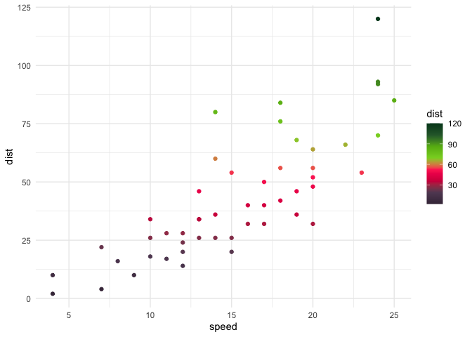

## Discrete colors

    ## example uses very handy ggridges package

    ggplot(data = iris, aes(x = Sepal.Length, y = Species, fill = Species)) + ggridges::geom_density_ridges(color = 'white', alpha = .4) + themeBayer::scale_fill_bayer_d(name = 'lights', direction = 1, n = 3) + theme_minimal()

    ## Picking joint bandwidth of 0.181

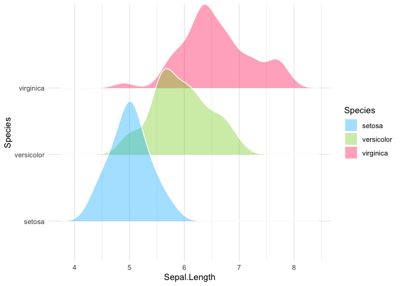

    ## direction < 0 gives colors in reverse order

## List of Color Scales

### blue\_green

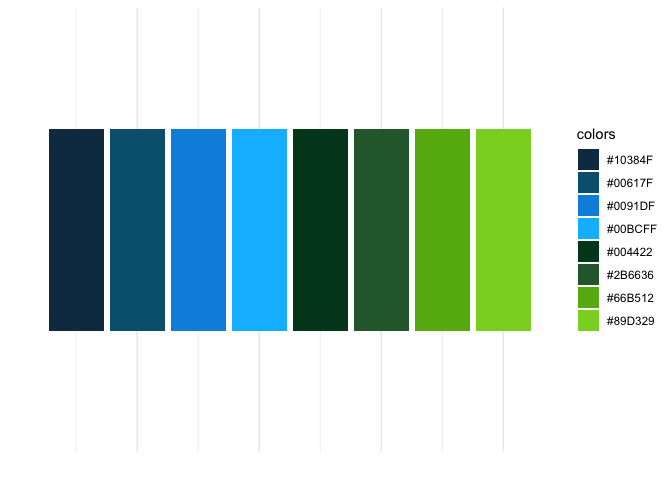

### purple\_green

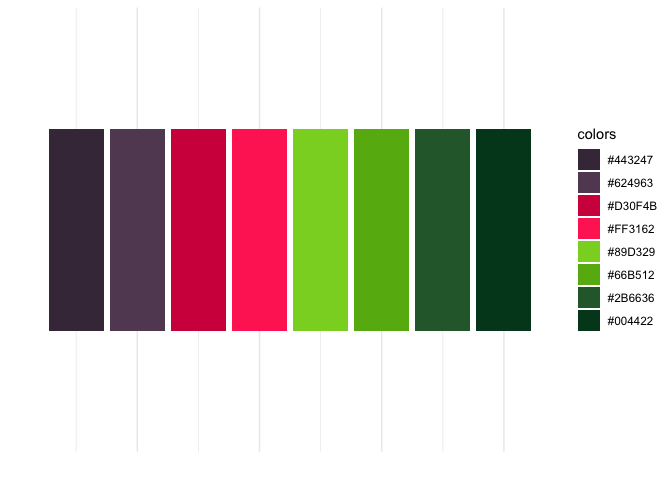

### lights

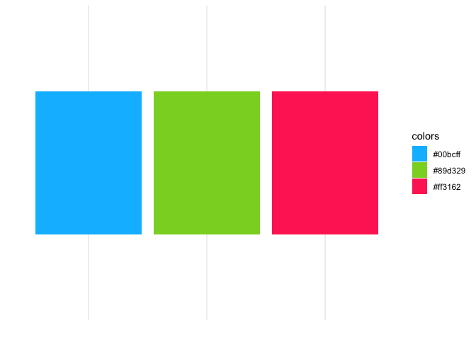

### darks

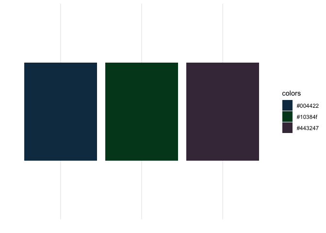

### mids

### greens

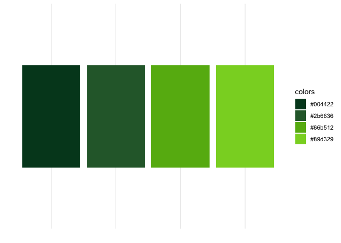

### purples

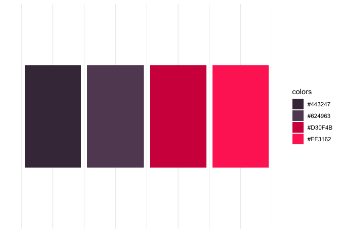

### blues

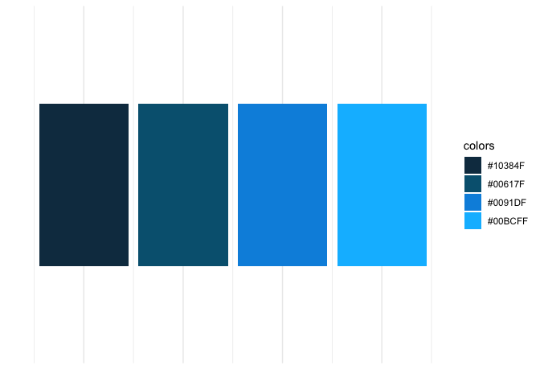

### all

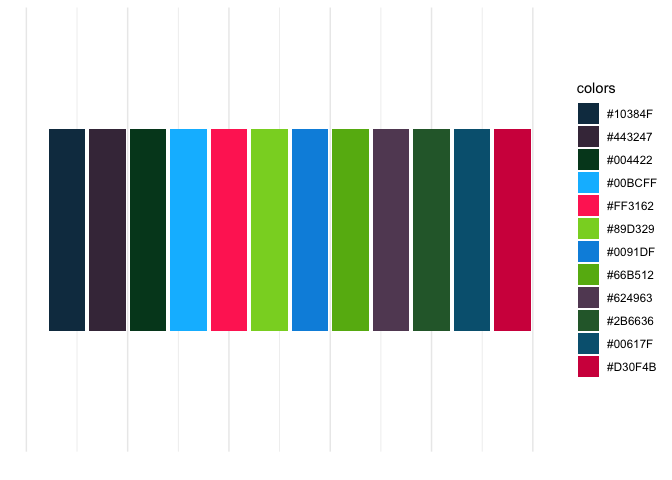

## Bayer RMarkdown Template

To aid in the creation of nice-looking Bayer-themed reports, we have
added an RMarkdown template to the `themeBayer` package. Once the
package is installed, you can use the template through the typical new
RMarkdown file interface:

1.  Select File &gt; New File &gt; RMarkdown 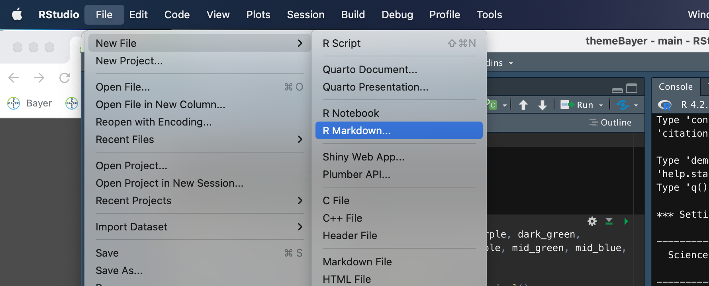

2.  In the resulting pop-up window, select the bottom option in the left
    sidebar, “From Template” and you should see “Bayer RMarkdown PDF” as
    an option near the top of the list (it is sorted alphabetically).
    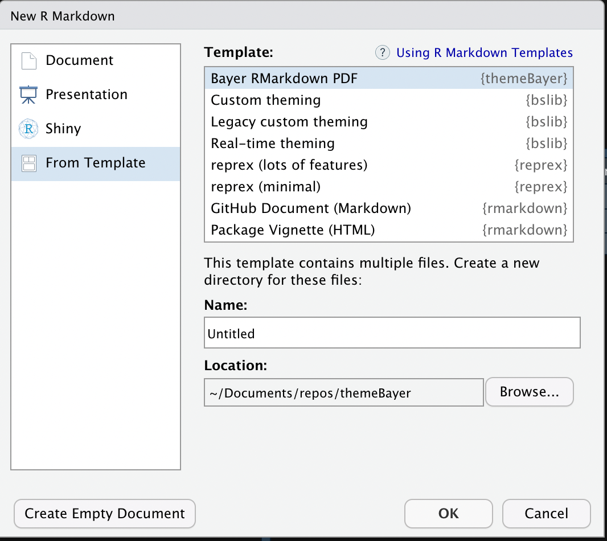

3.  Ensure to select a location for the RMarkdown document. Because this
    template includes files other than just the .Rmd template (i.e.,
    they Bayer logo .png) the system will create a folder in the target
    directory that contains the .Rmd and all necessary files.

4.  Begin working on the RMarkdown template! When knit immediately after
    opening the template has the following look (and each subsequent
    page has a header including the page number, section, and small
    Bayer logo): 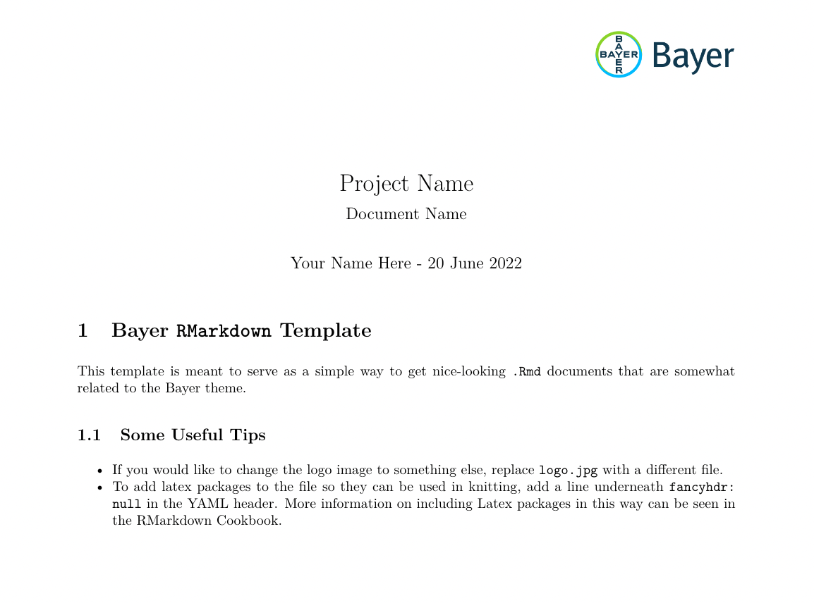

Note that currently there is only a PDF version of this template, but in
the future HTML and possible .md templates will be added.
