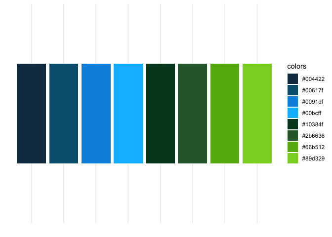
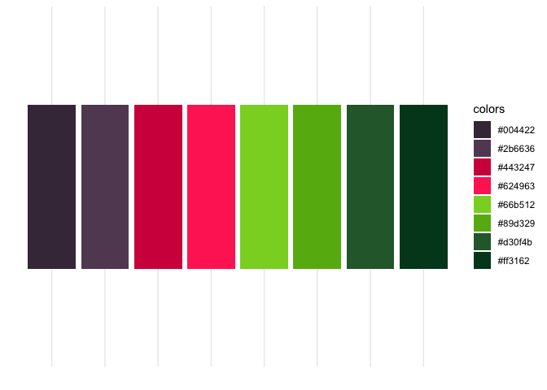
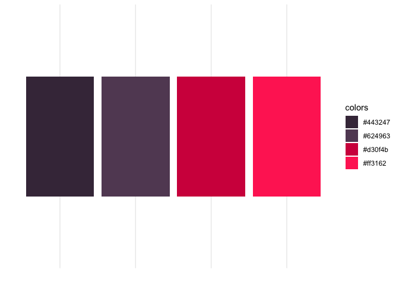
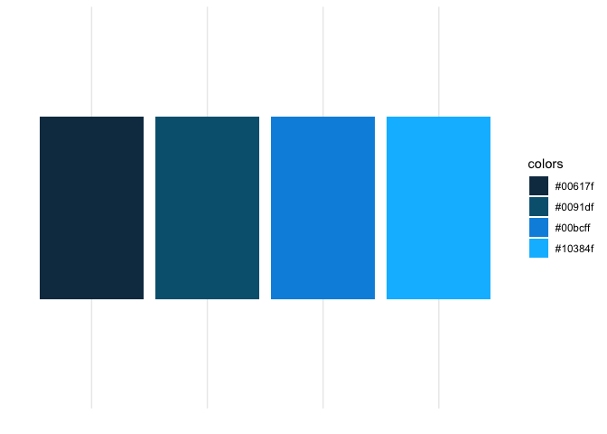
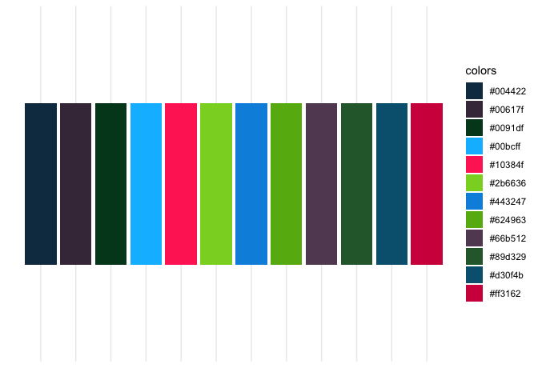

# Theme Bayer

## Introduction

`themeBayer` is an extension of the `ggplot2` package, and is designed
for internal coordination of R presentations and to ease the use of
company-official color schemes for ggplot. The main additions to the
ggplot library are color and fill color maps.

In general, you can use this package after install by invoking
`myplot + themeBayer::scale_(color/fill)_bayer_(c/d)()`.

Additionally, there is a rmarkdown template included as part of the
package that you can use to make your pdf documents include bayer
symbols/logo and may be themed using the functions in this package.

The list of available palettes are:

`blue_green, purple_green, lights, darks, mids, greens, purples, blues, all`

## Basic Usage

Continuous scales are not ‘officially’ approved, but can be generated by
interpolated between existing points.

    ggplot(data = cars, aes(x = speed, y = dist, color = dist)) +
    geom_point() + 
    themeBayer::scale_color_bayer_c(name = 'purple_green') + 
    theme_minimal()

## Discrete colors

    ## example uses very handy ggridges package

    ggplot(data = iris, aes(x = Sepal.Length, y = Species, fill = Species)) + 
    ggridges::geom_density_ridges(color = 'white', alpha = .4) + 
    themeBayer::scale_fill_bayer_d(name = 'lights', direction = 1, n = 3) + 
    theme_minimal()

    ## Picking joint bandwidth of 0.181

    ## direction < 0 gives colors in reverse order

## List of Color Scales

### blue\_green

### purple\_green

### lights

### darks

### mids

### greens

### purples

### blues

### all

