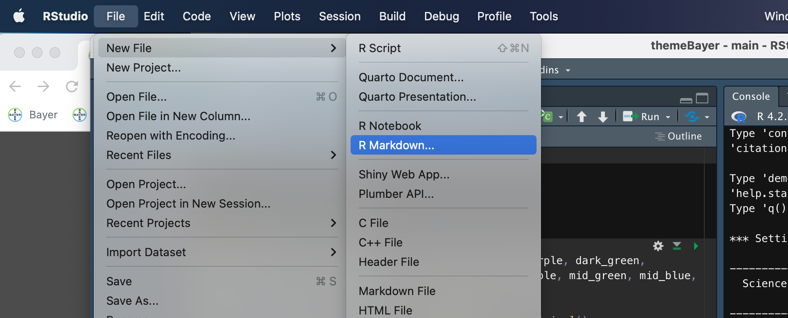
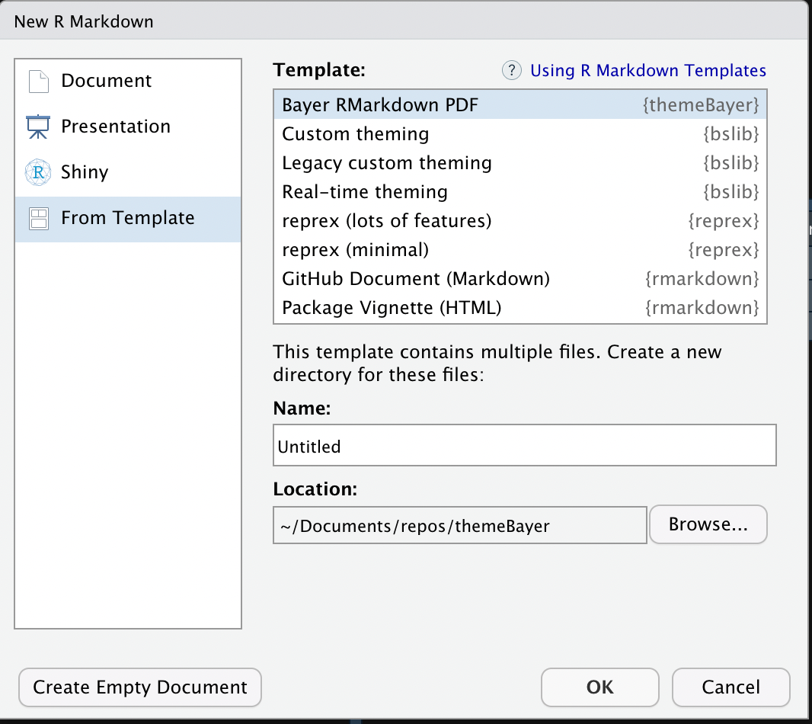
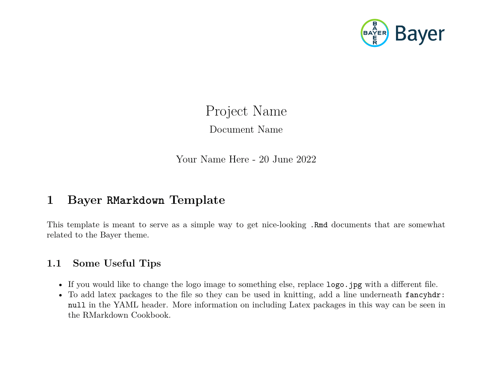

```{r setup, include=FALSE}
knitr::opts_chunk$set(echo = TRUE)

library(pacman)

p_load(tidyverse, ggridges)

library(themeBayer)

dark_blue <- "#10384f"
mid_blue <- "#00617f"
blue <- "#0091df"
light_blue <- "#00bcff"
dark_green <- "#004422"
mid_green <- "#2b6636"
green <- "#66b512"
light_green <- "#89d329"
dark_purple <- "#443247"
mid_purple <- "#624963"
raspberry <- "#d30f4b"
fuchsia <- "#ff3162"
white <- "#ffffff"
```

# Theme Bayer

## Introduction

`themeBayer` is an extension of the `ggplot2` package, and is designed for internal coordination of R presentations and to ease the use of company-official color schemes for ggplot. The main additions to the ggplot library are color and fill color maps.

In general, you can use this package after install by invoking `myplot + themeBayer::scale_(color/fill)_bayer_(c/d)()`. 

Additionally, there is a rmarkdown template included as part of the package that you can use to make your pdf documents include bayer symbols/logo and may be themed using the functions in this package.

## Basic Usage

Continuous scales are not 'officially' approved, but can be generated by interpolated between existing points.

```{r cont-plot}
ggplot(data = cars, aes(x = speed, y = dist, color = dist)) + geom_point() + themeBayer::scale_color_bayer_c(name = 'purple_green') + theme_minimal()
```

## Discrete colors

```{r disc-plot}
## example uses very handy ggridges package

ggplot(data = iris, aes(x = Sepal.Length, y = Species, fill = Species)) + ggridges::geom_density_ridges(color = 'white', alpha = .4) + themeBayer::scale_fill_bayer_d(name = 'lights', direction = 1, n = 3) + theme_minimal()

## direction < 0 gives colors in reverse order
```

## List of Color Scales

### blue_green

```{r, echo = F}
ggplot(data = data.frame(bar = rep(1, 8), colors = c("#10384f", "#00617f",
    "#0091df", "#00bcff",
    "#004422", "#2b6636",
    "#66b512", "#89d329")), aes(x = colors, fill = colors)) + geom_bar() + themeBayer::scale_fill_bayer_d(name = 'blue_green') + theme_minimal() + scale_y_discrete(labels = NULL, breaks = NULL) + labs(y = "", x = "") + theme(axis.text.x=element_blank())
```

### purple_green

```{r, echo = F}
ggplot(data = data.frame(colors = c(dark_purple, mid_purple, raspberry, fuchsia, light_green, green, mid_green, dark_green)), aes(x = colors, fill = colors)) + geom_bar() + themeBayer::scale_fill_bayer_d(name = 'purple_green') + theme_minimal() + scale_y_discrete(labels = NULL, breaks = NULL) + labs(y = "", x = "") + theme(axis.text.x=element_blank())
```

### lights

```{r, echo = F}
ggplot(data = data.frame(colors = c(light_blue, light_green, fuchsia)), aes(x = colors, fill = colors)) + geom_bar() + themeBayer::scale_fill_bayer_d(name = 'lights') + theme_minimal() + scale_y_discrete(labels = NULL, breaks = NULL) + labs(y = "", x = "") + theme(axis.text.x=element_blank())
```

### darks

```{r, echo = F}
ggplot(data = data.frame(colors =c(dark_blue, dark_green, dark_purple)), aes(x = colors, fill = colors)) + geom_bar() + themeBayer::scale_fill_bayer_d(name = 'darks') + theme_minimal() + scale_y_discrete(labels = NULL, breaks = NULL) + labs(y = "", x = "") + theme(axis.text.x=element_blank())
```

### mids

```{r, echo = F}
ggplot(data = data.frame(colors =c(mid_blue, mid_green, mid_purple)), aes(x = colors, fill = colors)) + geom_bar() + themeBayer::scale_fill_bayer_d(name = 'mids') + theme_minimal() + scale_y_discrete(labels = NULL, breaks = NULL) + labs(y = "", x = "") + theme(axis.text.x=element_blank())
```

### greens

```{r, echo = F}
ggplot(data = data.frame(colors =c(dark_green, mid_green, green, light_green)), aes(x = colors, fill = colors)) + geom_bar() + themeBayer::scale_fill_bayer_d(name = 'greens') + theme_minimal() + scale_y_discrete(labels = NULL, breaks = NULL) + labs(y = "", x = "") + theme(axis.text.x=element_blank())
```

### purples

```{r, echo = F}
ggplot(data = data.frame(colors =c(dark_purple, mid_purple, raspberry, fuchsia)), aes(x = colors, fill = colors)) + geom_bar() + themeBayer::scale_fill_bayer_d(name = 'purples') + theme_minimal() + scale_y_discrete(labels = NULL, breaks = NULL) + labs(y = "", x = "") + theme(axis.text.x=element_blank())
```

### blues

```{r, echo = F}
ggplot(data = data.frame(colors =c(dark_blue, mid_blue, blue, light_blue)), aes(x = colors, fill = colors)) + geom_bar() + themeBayer::scale_fill_bayer_d(name = 'blues') + theme_minimal() + scale_y_discrete(labels = NULL, breaks = NULL) + labs(y = "", x = "") + theme(axis.text.x=element_blank())
```


### all

```{r, echo = F}
ggplot(data = data.frame(colors = c(dark_blue, dark_purple, dark_green, light_blue, fuchsia, light_green, blue, green, mid_purple, mid_green, mid_blue, raspberry)
), aes(x = colors, fill = colors)) + geom_bar() + themeBayer::scale_fill_bayer_d(name = 'all') + theme_minimal() + scale_y_discrete(labels = NULL, breaks = NULL) + labs(y = "", x = "") + theme(axis.text.x=element_blank())
```


## Bayer RMarkdown Template

To aid in the creation of nice-looking Bayer-themed reports, we have added an RMarkdown template to the `themeBayer` package.
Once the package is installed, you can use the template through the typical new RMarkdown file interface:

1. Select File > New File > RMarkdown


2. In the resulting pop-up window, select the bottom option in the left sidebar, "From Template" and you should see "Bayer RMarkdown PDF" as an option near the top of the list (it is sorted alphabetically).


3. Ensure to select a location for the RMarkdown document. Because this template includes files other than just the .Rmd template (i.e., they Bayer logo .png) the system will create a folder in the target directory that contains the .Rmd and all necessary files.

4. Begin working on the RMarkdown template! When knit immediately after opening the template has the following look (and each subsequent page has a header including the page number, section, and small Bayer logo):


Note that currently there is only a PDF version of this template, but in the future HTML and possible .md templates will be added.
